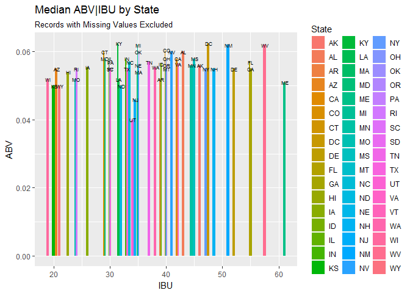

# DDS_CaseStudy_1_Beers&Breweries
Jack K. Rasmus-Vorrath  
June 24, 2017  
#Case Study of 2410 craft beers and 558 breweries from the United States

##This case study summaries, analyzes, and visualizes data on craft beers from breweries across the United States.
##From the available data, the study registers the number of unique breweries per state, calculates median and maximum Alcohol-by-Volume (ABV) and International Bitterness Units (IBU) values by state, and visualizes these measures across states for comparison. 


###Version/Environment Information
####Required Libraries not included in Base R: 'plyr', 'ggplot2' 

```r
R.version
```

```
##                _                           
## platform       x86_64-w64-mingw32          
## arch           x86_64                      
## os             mingw32                     
## system         x86_64, mingw32             
## status                                     
## major          3                           
## minor          3.3                         
## year           2017                        
## month          03                          
## day            06                          
## svn rev        72310                       
## language       R                           
## version.string R version 3.3.3 (2017-03-06)
## nickname       Another Canoe
```

```r
print((.packages()))
```

```
## [1] "stats"     "graphics"  "grDevices" "utils"     "datasets"  "methods"  
## [7] "base"
```

###Raw Data Import
####Note that local file paths must be adjusted to represent the user's directory structure.

```r
Beers <- read.csv("C:/Users/jkras/Desktop/R_Docs/R_Projects/DDS_CaseStudy_1/Raw_Data/Beers.csv")
Breweries <- read.csv("C:/Users/jkras/Desktop/R_Docs/R_Projects/DDS_CaseStudy_1/Raw_Data/Breweries.csv")
```


###The first question of interest concerned the number of unique breweries per state.
####The spread is from 1 (SD, ND, WV, DC) to 47 (CO), with Colorado far surpassing the number in other states; California comes in at second with 39.

```r
attach(Breweries)

Breweries_per_State <- aggregate(Name ~ State, data = Breweries, FUN = length)
Breweries_per_State
```

```
##    State Name
## 1     AK    7
## 2     AL    3
## 3     AR    2
## 4     AZ   11
## 5     CA   39
## 6     CO   47
## 7     CT    8
## 8     DC    1
## 9     DE    2
## 10    FL   15
## 11    GA    7
## 12    HI    4
## 13    IA    5
## 14    ID    5
## 15    IL   18
## 16    IN   22
## 17    KS    3
## 18    KY    4
## 19    LA    5
## 20    MA   23
## 21    MD    7
## 22    ME    9
## 23    MI   32
## 24    MN   12
## 25    MO    9
## 26    MS    2
## 27    MT    9
## 28    NC   19
## 29    ND    1
## 30    NE    5
## 31    NH    3
## 32    NJ    3
## 33    NM    4
## 34    NV    2
## 35    NY   16
## 36    OH   15
## 37    OK    6
## 38    OR   29
## 39    PA   25
## 40    RI    5
## 41    SC    4
## 42    SD    1
## 43    TN    3
## 44    TX   28
## 45    UT    4
## 46    VA   16
## 47    VT   10
## 48    WA   23
## 49    WI   20
## 50    WV    1
## 51    WY    4
```


###Producing summary statistics of interest required cleaning up feature names of the two data frames to merge them by a Brewery identifier key, 'Brewery_ID'.
###The head and tail of the resulting data frame was checked to verify a successful merge.

```r
library(plyr)

attach(Breweries)
```

```
## The following objects are masked from Breweries (pos = 4):
## 
##     Brew_ID, City, Name, State
```

```r
names(Breweries)
```

```
## [1] "Brew_ID" "Name"    "City"    "State"
```

```r
renamed_Breweries <- rename(Breweries, replace = c("Brew_ID" = "Brewery_ID"))
names(renamed_Breweries)
```

```
## [1] "Brewery_ID" "Name"       "City"       "State"
```

```r
attach(Beers)
```

```
## The following object is masked from Breweries (pos = 3):
## 
##     Name
```

```
## The following object is masked from Breweries (pos = 5):
## 
##     Name
```

```r
names(Beers)
```

```
## [1] "Name"       "Beer_ID"    "ABV"        "IBU"        "Brewery_id"
## [6] "Style"      "Ounces"
```

```r
renamed_Beers <- rename(Beers, replace = c("Brewery_id" = "Brewery_ID"))
names(renamed_Beers)
```

```
## [1] "Name"       "Beer_ID"    "ABV"        "IBU"        "Brewery_ID"
## [6] "Style"      "Ounces"
```

```r
Beer_Brew <- merge(x = renamed_Beers, y = renamed_Breweries, by = "Brewery_ID", all = T)
names(Beer_Brew)
```

```
##  [1] "Brewery_ID" "Name.x"     "Beer_ID"    "ABV"        "IBU"       
##  [6] "Style"      "Ounces"     "Name.y"     "City"       "State"
```

```r
renamed_Beer_Brew <- rename(Beer_Brew, replace = c("Name.x" = "Beer", "Name.y" = "Brewery"))
names(renamed_Beer_Brew)
```

```
##  [1] "Brewery_ID" "Beer"       "Beer_ID"    "ABV"        "IBU"       
##  [6] "Style"      "Ounces"     "Brewery"    "City"       "State"
```

```r
head(renamed_Beer_Brew)
```

```
##   Brewery_ID          Beer Beer_ID   ABV IBU
## 1          1  Get Together    2692 0.045  50
## 2          1 Maggie's Leap    2691 0.049  26
## 3          1    Wall's End    2690 0.048  19
## 4          1       Pumpion    2689 0.060  38
## 5          1    Stronghold    2688 0.060  25
## 6          1   Parapet ESB    2687 0.056  47
##                                 Style Ounces            Brewery
## 1                        American IPA     16 NorthGate Brewing 
## 2                  Milk / Sweet Stout     16 NorthGate Brewing 
## 3                   English Brown Ale     16 NorthGate Brewing 
## 4                         Pumpkin Ale     16 NorthGate Brewing 
## 5                     American Porter     16 NorthGate Brewing 
## 6 Extra Special / Strong Bitter (ESB)     16 NorthGate Brewing 
##          City State
## 1 Minneapolis    MN
## 2 Minneapolis    MN
## 3 Minneapolis    MN
## 4 Minneapolis    MN
## 5 Minneapolis    MN
## 6 Minneapolis    MN
```

```r
tail(renamed_Beer_Brew)
```

```
##      Brewery_ID                      Beer Beer_ID   ABV IBU
## 2405        556             Pilsner Ukiah      98 0.055  NA
## 2406        557  Heinnieweisse Weissebier      52 0.049  NA
## 2407        557           Snapperhead IPA      51 0.068  NA
## 2408        557         Moo Thunder Stout      50 0.049  NA
## 2409        557         Porkslap Pale Ale      49 0.043  NA
## 2410        558 Urban Wilderness Pale Ale      30 0.049  NA
##                        Style Ounces                       Brewery
## 2405         German Pilsener     12         Ukiah Brewing Company
## 2406              Hefeweizen     12       Butternuts Beer and Ale
## 2407            American IPA     12       Butternuts Beer and Ale
## 2408      Milk / Sweet Stout     12       Butternuts Beer and Ale
## 2409 American Pale Ale (APA)     12       Butternuts Beer and Ale
## 2410        English Pale Ale     12 Sleeping Lady Brewing Company
##               City State
## 2405         Ukiah    CA
## 2406 Garrattsville    NY
## 2407 Garrattsville    NY
## 2408 Garrattsville    NY
## 2409 Garrattsville    NY
## 2410     Anchorage    AK
```


###A summary of the missing feature values of the clean merged data frame was conducted before proceeding with analysis.
####Missing values included 62 records without measures for Alcohol-by-Volume, and 1005 records without measures for International Bitterness Units.

```r
NA_counts<- sapply(renamed_Beer_Brew, function(x) sum(is.na(x)))
NA_counts
```

```
## Brewery_ID       Beer    Beer_ID        ABV        IBU      Style 
##          0          0          0         62       1005          0 
##     Ounces    Brewery       City      State 
##          0          0          0          0
```


###Analysis of particular features of the data included an evaluation and visualization of median Alcohol-by-Volume and International Bitterness Units values of beers by state.
####With a few exceptions, the figure demonstrated a roughly uniform distribution of the relation between median ABV and IBU across states.
####While median bitterness ranged between approximately 20 (WI) and 60 (ME) IBU, median ABV ranged from roughly .04 to .06.

```r
library(ggplot2)

Med_ABVbyState <- aggregate(ABV ~ State, data = renamed_Beer_Brew, FUN = median)
Med_ABVbyState
```

```
##    State    ABV
## 1     AK 0.0560
## 2     AL 0.0600
## 3     AR 0.0520
## 4     AZ 0.0550
## 5     CA 0.0580
## 6     CO 0.0605
## 7     CT 0.0600
## 8     DC 0.0625
## 9     DE 0.0550
## 10    FL 0.0570
## 11    GA 0.0550
## 12    HI 0.0540
## 13    IA 0.0555
## 14    ID 0.0565
## 15    IL 0.0580
## 16    IN 0.0580
## 17    KS 0.0500
## 18    KY 0.0625
## 19    LA 0.0520
## 20    MA 0.0540
## 21    MD 0.0580
## 22    ME 0.0510
## 23    MI 0.0620
## 24    MN 0.0560
## 25    MO 0.0520
## 26    MS 0.0580
## 27    MT 0.0550
## 28    NC 0.0570
## 29    ND 0.0500
## 30    NE 0.0560
## 31    NH 0.0550
## 32    NJ 0.0460
## 33    NM 0.0620
## 34    NV 0.0600
## 35    NY 0.0550
## 36    OH 0.0580
## 37    OK 0.0600
## 38    OR 0.0560
## 39    PA 0.0570
## 40    RI 0.0550
## 41    SC 0.0550
## 42    SD 0.0600
## 43    TN 0.0570
## 44    TX 0.0550
## 45    UT 0.0400
## 46    VA 0.0565
## 47    VT 0.0550
## 48    WA 0.0555
## 49    WI 0.0520
## 50    WV 0.0620
## 51    WY 0.0500
```

```r
Med_IBUbyState <- aggregate(IBU ~ State, data = renamed_Beer_Brew, FUN = median)
Med_IBUbyState
```

```
##    State  IBU
## 1     AK 46.0
## 2     AL 43.0
## 3     AR 39.0
## 4     AZ 20.5
## 5     CA 42.0
## 6     CO 40.0
## 7     CT 29.0
## 8     DC 47.5
## 9     DE 52.0
## 10    FL 55.0
## 11    GA 55.0
## 12    HI 22.5
## 13    IA 26.0
## 14    ID 39.0
## 15    IL 30.0
## 16    IN 33.0
## 17    KS 20.0
## 18    KY 31.5
## 19    LA 31.5
## 20    MA 35.0
## 21    MD 29.0
## 22    ME 61.0
## 23    MI 35.0
## 24    MN 44.5
## 25    MO 24.0
## 26    MS 45.0
## 27    MT 40.0
## 28    NC 33.5
## 29    ND 32.0
## 30    NE 35.0
## 31    NH 48.5
## 32    NJ 34.5
## 33    NM 51.0
## 34    NV 41.0
## 35    NY 47.0
## 36    OH 40.0
## 37    OK 35.0
## 38    OR 40.0
## 39    PA 30.0
## 40    RI 24.0
## 41    SC 30.0
## 42    TN 37.0
## 43    TX 33.0
## 44    UT 34.0
## 45    VA 42.0
## 46    VT 30.0
## 47    WA 38.0
## 48    WI 19.0
## 49    WV 57.5
## 50    WY 21.0
```

```r
merged_Med_ABV_IBU_byState <- merge(x = Med_ABVbyState, y = Med_IBUbyState, by = "State", all = T)
merged_Med_ABV_IBU_byState
```

```
##    State    ABV  IBU
## 1     AK 0.0560 46.0
## 2     AL 0.0600 43.0
## 3     AR 0.0520 39.0
## 4     AZ 0.0550 20.5
## 5     CA 0.0580 42.0
## 6     CO 0.0605 40.0
## 7     CT 0.0600 29.0
## 8     DC 0.0625 47.5
## 9     DE 0.0550 52.0
## 10    FL 0.0570 55.0
## 11    GA 0.0550 55.0
## 12    HI 0.0540 22.5
## 13    IA 0.0555 26.0
## 14    ID 0.0565 39.0
## 15    IL 0.0580 30.0
## 16    IN 0.0580 33.0
## 17    KS 0.0500 20.0
## 18    KY 0.0625 31.5
## 19    LA 0.0520 31.5
## 20    MA 0.0540 35.0
## 21    MD 0.0580 29.0
## 22    ME 0.0510 61.0
## 23    MI 0.0620 35.0
## 24    MN 0.0560 44.5
## 25    MO 0.0520 24.0
## 26    MS 0.0580 45.0
## 27    MT 0.0550 40.0
## 28    NC 0.0570 33.5
## 29    ND 0.0500 32.0
## 30    NE 0.0560 35.0
## 31    NH 0.0550 48.5
## 32    NJ 0.0460 34.5
## 33    NM 0.0620 51.0
## 34    NV 0.0600 41.0
## 35    NY 0.0550 47.0
## 36    OH 0.0580 40.0
## 37    OK 0.0600 35.0
## 38    OR 0.0560 40.0
## 39    PA 0.0570 30.0
## 40    RI 0.0550 24.0
## 41    SC 0.0550 30.0
## 42    SD 0.0600   NA
## 43    TN 0.0570 37.0
## 44    TX 0.0550 33.0
## 45    UT 0.0400 34.0
## 46    VA 0.0565 42.0
## 47    VT 0.0550 30.0
## 48    WA 0.0555 38.0
## 49    WI 0.0520 19.0
## 50    WV 0.0620 57.5
## 51    WY 0.0500 21.0
```

```r
ABV_v_IBU <- ggplot(merged_Med_ABV_IBU_byState, aes(IBU, ABV, group = State)) + geom_col(aes(fill = State), position = "dodge") + geom_text(aes(label = State), position = "dodge", size = 2) + labs(title = "Median ABV|IBU by State", subtitle = "Records with Missing Values Excluded")
ABV_v_IBU
```

```
## Warning: Width not defined. Set with `position_dodge(width = ?)`
```

```
## Warning: Removed 1 rows containing missing values (geom_col).
```

```
## Warning: Removed 1 rows containing missing values (geom_text).
```

<!-- -->


###Analysis also included an evaluation of maximum Alcohol-by-Volume and International Bitterness Units values of beers by state, and across all states.
####Colorado again sets a precedent with a maximum .128 ABV value, with Kentucky in a close second (.125).
####Meanwhile, Oregon asserts its place as the state producing the most bitter of beers with an IBU of 138; Virgina takes a close second, producing a beer with IBU of 135.

```r
Max_ABVbyState <- aggregate(ABV ~ State, data = renamed_Beer_Brew, FUN = max)
Max_ABVbyState
```

```
##    State   ABV
## 1     AK 0.068
## 2     AL 0.093
## 3     AR 0.061
## 4     AZ 0.095
## 5     CA 0.099
## 6     CO 0.128
## 7     CT 0.090
## 8     DC 0.092
## 9     DE 0.055
## 10    FL 0.082
## 11    GA 0.072
## 12    HI 0.083
## 13    IA 0.095
## 14    ID 0.099
## 15    IL 0.096
## 16    IN 0.120
## 17    KS 0.085
## 18    KY 0.125
## 19    LA 0.088
## 20    MA 0.099
## 21    MD 0.085
## 22    ME 0.099
## 23    MI 0.099
## 24    MN 0.099
## 25    MO 0.080
## 26    MS 0.080
## 27    MT 0.075
## 28    NC 0.099
## 29    ND 0.067
## 30    NE 0.096
## 31    NH 0.065
## 32    NJ 0.099
## 33    NM 0.080
## 34    NV 0.099
## 35    NY 0.100
## 36    OH 0.099
## 37    OK 0.085
## 38    OR 0.088
## 39    PA 0.099
## 40    RI 0.086
## 41    SC 0.097
## 42    SD 0.069
## 43    TN 0.062
## 44    TX 0.099
## 45    UT 0.090
## 46    VA 0.088
## 47    VT 0.096
## 48    WA 0.084
## 49    WI 0.099
## 50    WV 0.067
## 51    WY 0.072
```

```r
Max_ABV_All <- max(Max_ABVbyState$ABV)
Max_ABV_All
```

```
## [1] 0.128
```

```r
Max_ABV_All_row <- subset(Max_ABVbyState, ABV == .128)
Max_ABV_All_row
```

```
##   State   ABV
## 6    CO 0.128
```

```r
Max_IBUbyState <- aggregate(IBU ~ State, data = renamed_Beer_Brew, FUN = max)
Max_IBUbyState
```

```
##    State IBU
## 1     AK  71
## 2     AL 103
## 3     AR  39
## 4     AZ  99
## 5     CA 115
## 6     CO 104
## 7     CT  85
## 8     DC 115
## 9     DE  52
## 10    FL  82
## 11    GA  65
## 12    HI  75
## 13    IA  99
## 14    ID 100
## 15    IL 100
## 16    IN 115
## 17    KS 110
## 18    KY  80
## 19    LA  60
## 20    MA 130
## 21    MD  90
## 22    ME  70
## 23    MI 115
## 24    MN 120
## 25    MO  89
## 26    MS  80
## 27    MT  80
## 28    NC  98
## 29    ND  70
## 30    NE  65
## 31    NH  82
## 32    NJ 100
## 33    NM 100
## 34    NV  90
## 35    NY 111
## 36    OH 126
## 37    OK 100
## 38    OR 138
## 39    PA 113
## 40    RI  75
## 41    SC  65
## 42    TN  61
## 43    TX 118
## 44    UT  83
## 45    VA 135
## 46    VT 120
## 47    WA  83
## 48    WI  80
## 49    WV  71
## 50    WY  75
```

```r
Max_IBU_All <- max(Max_IBUbyState$IBU)
Max_IBU_All
```

```
## [1] 138
```

```r
Max_IBU_All_row <- subset(Max_IBUbyState, IBU == 138)
Max_IBU_All_row
```

```
##    State IBU
## 38    OR 138
```


###Summary statistical measures of Alcohol-by-Volume values for all beers across states were also evaluated.
####The distribution of ABV values ranges from 0.001 to Colorado's 0.128, and is only slightly right skewed, with an overall median and mean ABV of 0.056 and 0.05977, respectively.

```r
ABV_Stats <- summary(renamed_Beer_Brew$ABV)
ABV_Stats
```

```
##    Min. 1st Qu.  Median    Mean 3rd Qu.    Max.    NA's 
## 0.00100 0.05000 0.05600 0.05977 0.06700 0.12800      62
```


###A final visualization was produced of the relation between Alcohol-by-Volume and International Bitterness Units values of beers across states.
####Excepting outliers, and bearing in mind records with missing ABV or IBU values excluded from the figure, the scatterplot indicated a relatively strong quadratic negative correlation between the two measures of interest.

```r
library(ggplot2)

ABV_v_IBU_Scatter <- ggplot(renamed_Beer_Brew, aes(IBU, ABV, label = State)) + geom_text(size = 1, check_overlap = T) + geom_label(aes(fill = State), color = "black", label.padding = unit(.1, "lines"), label.size = .1) + labs(title = "ABV|IBU by State", subtitle = "Records with Missing Values Excluded")
ABV_v_IBU_Scatter
```

```
## Warning: Removed 1005 rows containing missing values (geom_text).
```

```
## Warning: Removed 1005 rows containing missing values (geom_label).
```

<!-- -->


####On the whole, the data suggested that tastes for beer in the U.S. are as diverse as the demographics of its states.
###However, no matter where one chooses to imbibe, the relation between bitterness and bigger buzz holds only to a certain point!
